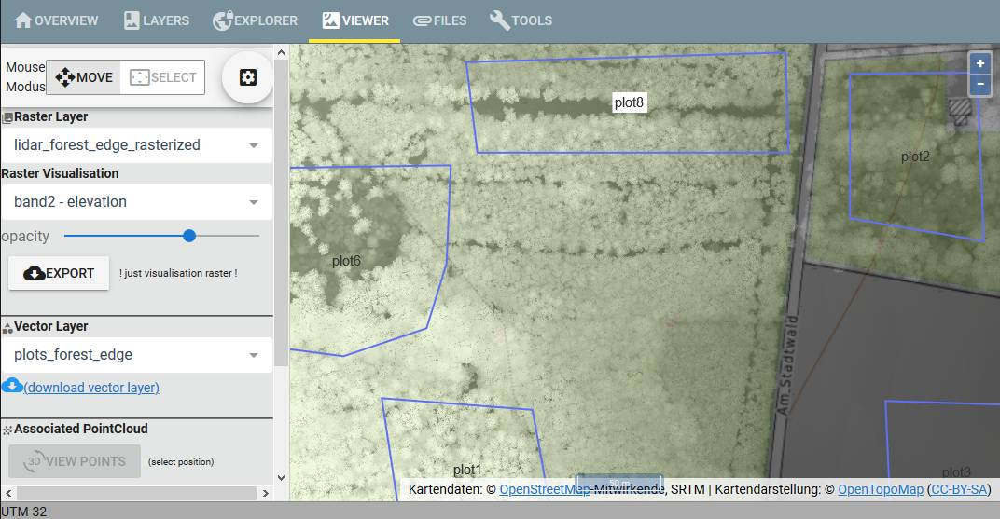
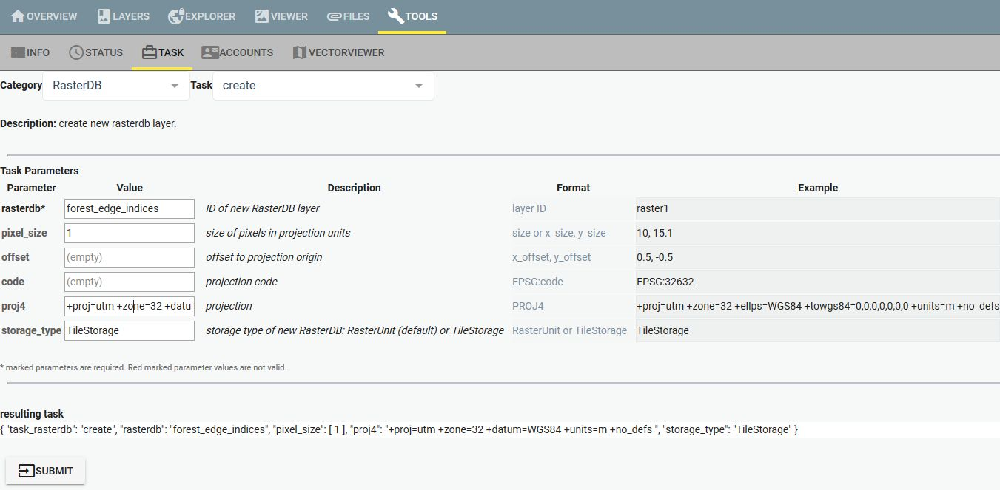
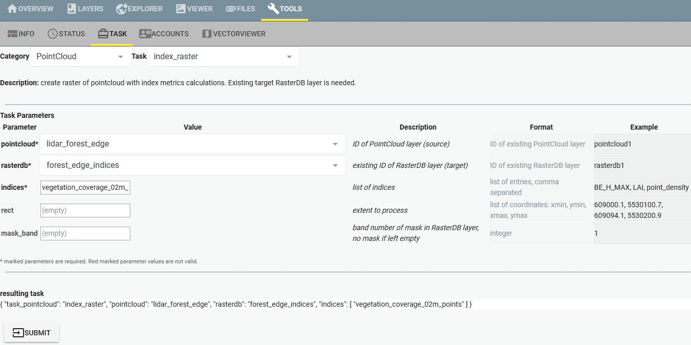
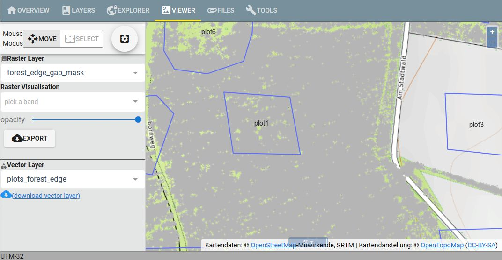

# processing

RSDB can be accessed by R-package.

Example R-scripts are located in folder `example-data/r_script`.

**Note**: RSDB server needs to be running at the current local computer. If you run RSDB server on a different computer you need to change the URL for connection creation in the scripts (`RSDB::RemoteSensing$new(url = "http://127.0.0.1:8081")`).

The **web interface** of a local running RSDB server can opened at:  
[http://127.0.0.1:8081](http://127.0.0.1:8081)

## 01_processing.R

With this script point cloud indices are requested from RSDB. The point cloud layer `lidar_forest_edge` serves as point cloud source and the ROI layer `plots_forest_edge` contains the plot polygons.  
Point cloud indices are documented on the [RSDB wiki](https://github.com/environmentalinformatics-marburg/rsdb/wiki/Point-cloud-indices).

The script sends a processing request to RSDB with a set of point cloud index names. A data.frame with resulting index values is received.

Point cloud indices can be calculated per pixel on a raster layer target. As this is a potentially long running operation a task is created on the web interface, started and checked until the task finished.  
Often the pixel values are needed at some pixel locations only. For this a mask with desired pixels can be used in the processing task which then processes that pixels only for processing time reasons. In this example a mask of the plot polygons is prepared.

**Note**: You can directly run this script because in the example package the point cloud layer `lidar_forest_edge` and the vector layer (and ROI layer) `plots_forest_edge` is uploaded into RSDB already.

## 02_create_gap_mask.R

This script creates a gap mask from a raster with index values.  
Before this script can be run the raster layer `forest_edge_indices` needs to be created.

The first task creates a new raster layer in the web interface - "TOOLS - TASK":    
**category**: `RasterDB` - **Task**: `create`
| Parameter | Value |
| --- | --- |
| **rasterdb** | `forest_edge_indices` |
| **pixel_size** | `1` |
| **proj4** | `+proj=utm +zone=32 +datum=WGS84 +units=m +no_defs ` |

The second task calculates the index values in the created raster:  
**category**: `PointCloud` - **Task**: `index_raster`  
| Parameter | Value |
| --- | --- |
| **pointcloud** | `lidar_forest_edge` |
| **rasterdb** | `forest_edge_indices` | 
| **indices** | `vegetation_coverage_02m_points` |

Based on the previously processed raster layer a forest gap mask is created in the script and uploaded into RSDB a new layer (`forest_edge_gap_mask`).

**Note**: You can directly run this script because in the example package the processed raster layer `forest_edge_indices` is uploaded into RSDB already.

## 03_get_gap_metrics.R

This script loads the raster data from RSDB which resulted from the previous script (`forest_edge_gap_mask`) and calculates some gap metrics. It is an example for using RSDB data for further processing in R.

**Note**: You can directly run this script because in the example package the processed raster layer `forest_edge_gap_mask` is uploaded into RSDB already.